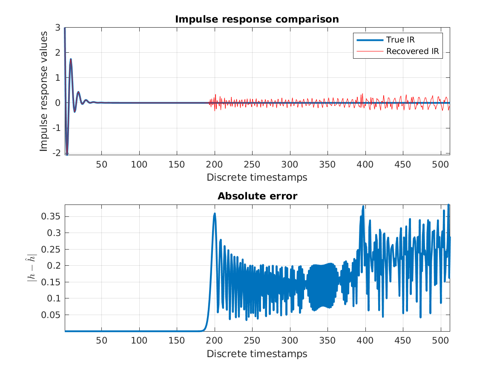
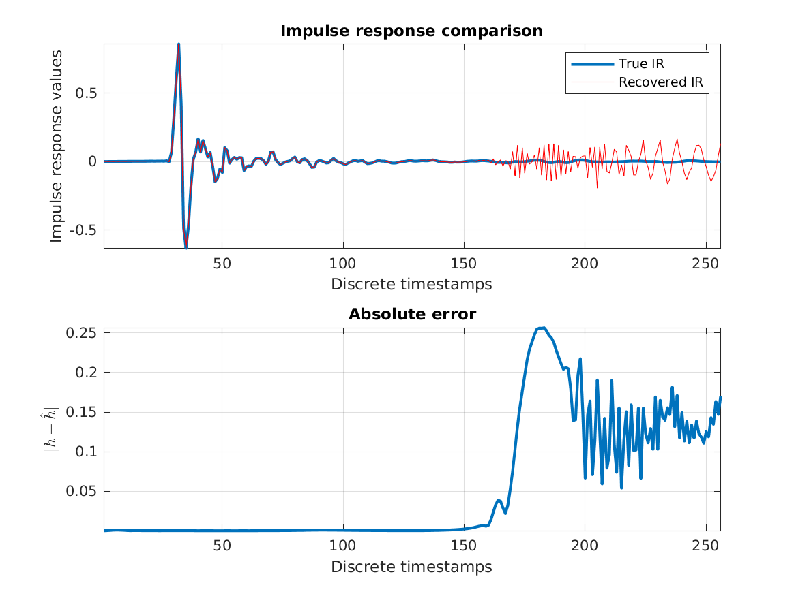

# MATLAB scripts

Standalone scripts are in this directory. Functions and libraries shared by these scripts can be found in `Common`.

## Common directory
Stores shared libraries and functions. Currently, it contains the [RAIT library](https://doi.org/10.1109/TSP.2012.6256382) to deal with rational ONS.

## Scripts
- [`toy_example.m`](toy_example.m) Showcases the transformation chain to retrieve the IR from input/output data on a small LTI system with three poles.
- [`fabian.m`](fabian.m) An example using a measured HRTF.

## Figures

### Toy example

### Fabian

